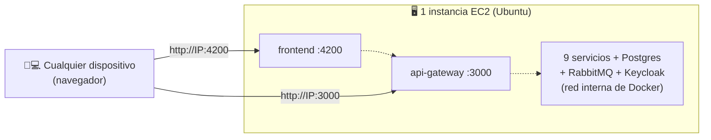

# Desplegar AegisCase en AWS (EC2 + Docker) — acceso desde cualquier dispositivo

Guía rápida para subir **todo el sistema** (backend + frontend + infraestructura) a una sola
instancia EC2 y acceder por **IP pública (HTTP)**. Es el camino más rápido: la misma `docker compose`
que ya funciona localmente corre igual en la nube.

> Modo elegido: **IP pública + HTTP** (sin dominio ni certificados). Para "production-like" con
> dominio y HTTPS, ver la sección final *"Mejoras opcionales"*.

---

## 0. Resumen de la arquitectura del despliegue



- **Solo 2 puertos públicos:** `4200` (frontend) y `3000` (gateway). Todo lo demás (DB, RabbitMQ,
  Keycloak) queda **interno** en la red de Docker → más simple y más seguro.
- El navegador **no habla con Keycloak directamente** (el login va por el gateway), así que no hace
  falta exponer Keycloak ni tocar redirect URIs.

---

## 1. Crear la instancia EC2

En la consola de AWS → **EC2 → Launch instance**:

| Opción | Valor recomendado |
|---|---|
| **AMI** | Ubuntu Server 24.04 LTS (o 22.04) |
| **Tipo** | **t3.large** (8 GB RAM) — el stack incluye Keycloak (JVM) + 9 servicios Node |
| **Key pair** | Creá/elegí uno (lo usás para SSH) |
| **Almacenamiento** | **30 GB** gp3 (para las imágenes Docker y el build) |

> Una `t3.medium` (4 GB) puede ir justa durante el build; si querés ahorrar, probá esa, pero la
> `t3.large` es la opción segura.

---

## 2. Configurar el Security Group (firewall)

Agregá estas reglas de **entrada (inbound)**:

| Tipo | Puerto | Origen | Para qué |
|---|---|---|---|
| SSH | 22 | **Tu IP** (My IP) | conectarte por SSH |
| Custom TCP | 4200 | `0.0.0.0/0` | frontend (la app) |
| Custom TCP | 3000 | `0.0.0.0/0` | API gateway |

> **No abras** 5432 (Postgres), 5672/15672 (RabbitMQ) ni 8080 (Keycloak): no necesitan ser
> públicos y exponerlos es un riesgo.

---

## 3. (Recomendado) Asignar una Elastic IP

Una **Elastic IP** te da una **IP fija**. Importante porque el frontend se construye "horneando" la
IP del API: si la IP cambia (al apagar/encender la instancia), tendrías que reconstruir el FE.

EC2 → **Elastic IPs → Allocate** → **Associate** a tu instancia. Usá esa IP en los pasos siguientes.

---

## 4. Conectarte por SSH

```bash
ssh -i /ruta/a/tu-key.pem ubuntu@<IP-PUBLICA>
```

---

## 5. Desplegar (con el script automático)

El repo trae un script que instala Docker, clona ambos repos, detecta la IP pública y levanta todo.

```bash
# 1) Descargá el script (o copialo) y editá las URLs de tus repos
sudo mkdir -p /opt && cd /opt
sudo apt-get update -y && sudo apt-get install -y git

# 2) Cloná SOLO el backend para tener el script a mano
sudo git clone https://github.com/USUARIO/AegisCase_BE.git
cd AegisCase_BE/deploy

# 3) Editá las variables al inicio de aws-setup.sh:
#      BE_REPO, FE_REPO, FE_BRANCH (la rama del FE con el Dockerfile, ej. phase_10)
sudo nano aws-setup.sh

# 4) Ejecutalo
sudo bash aws-setup.sh
```

El script:
- instala Docker + Compose,
- clona backend y frontend como **carpetas hermanas** en `/opt/aegiscase`,
- detecta la **IP pública** y configura `VITE_API_BASE_URL=http://<IP>:3000` y `CORS_ORIGIN=*`,
- construye las imágenes (secuencial, para evitar timeouts de npm) y hace `docker compose up -d`.

La **primera vez tarda varios minutos** (compila ~10 imágenes + Keycloak importa el realm).

> **Repos privados:** si tus repos no son públicos, usá una URL con token en `BE_REPO`/`FE_REPO`:
> `https://<TOKEN>@github.com/USUARIO/AegisCase_FE.git` (creá un *Personal Access Token* en GitHub).

### Alternativa: como "User data" al crear la EC2
Podés pegar el contenido de `deploy/aws-setup.sh` (con `BE_REPO`/`FE_REPO`/`FE_BRANCH` completados)
en el campo **User data** del paso de creación. La instancia se autoconfigura al primer arranque
(esperá ~10-15 min y entrá directo al paso 6).

---

## 6. Acceder

Abrí en **cualquier dispositivo**:

```
http://<IP-PUBLICA>:4200
```

Iniciá sesión con un usuario de prueba:

| Rol | Email | Contraseña |
|---|---|---|
| Admin | `admin@aegiscase.com` | `Admin1234!` |
| Detective | `detective@aegiscase.com` | `Detective1234!` |
| Analyst | `analyst@aegiscase.com` | `Analyst1234!` |

---

## 7. Operación del día a día

```bash
cd /opt/aegiscase/AegisCase_BE

docker compose ps                 # estado de los contenedores
docker compose logs -f api-gateway   # ver logs de un servicio
docker compose restart api-gateway   # reiniciar un servicio
docker compose down               # detener todo (los datos persisten en volúmenes)
docker compose up -d              # volver a levantar
```

**Apagar para ahorrar:** detené la **instancia** desde la consola de AWS cuando no la uses (con
Elastic IP, la IP se mantiene). Al encenderla, los contenedores arrancan solos si dejaste
`restart: unless-stopped` (ya está configurado).

**Actualizar a una nueva versión del código:**
```bash
cd /opt/aegiscase/AegisCase_BE && git pull
cd /opt/aegiscase/AegisCase_FE && git pull
cd /opt/aegiscase/AegisCase_BE && docker compose up -d --build
```

---

## 8. Seguridad (importante si queda expuesto)

Esto usa credenciales **por defecto** (pensadas para desarrollo). Si va a estar accesible
públicamente más de una demo, cambiá al menos:

- `KEYCLOAK_ADMIN_PASSWORD` (consola de Keycloak)
- `RABBITMQ_PASSWORD`, `DB_PASSWORD`
- `JWT_SECRET` (un valor largo y aleatorio)
- `KEYCLOAK_CLIENT_SECRET` (y el mismo valor en el realm)

Se cambian en el archivo `.env` del backend y luego `docker compose up -d`. Y **mantené cerrados**
los puertos internos (5432/5672/15672/8080) en el Security Group.

---

## 9. Costos (orientativo)

- **t3.large**: ~USD 60/mes si está encendida 24/7. **Apagándola cuando no la usás**, pagás solo las
  horas activas (centavos por hora) + el disco EBS (~USD 2-3/mes por 30 GB).
- **Elastic IP**: gratis mientras está asociada a una instancia en ejecución.
- No entra en *free tier* por la RAM que necesita el stack.

---

## 10. Mejoras opcionales (para "production-like")

Si más adelante querés un **dominio + HTTPS** (recomendado para algo permanente):

1. Apuntá un dominio (Route 53 u otro) a la Elastic IP.
2. Poné un **reverse proxy con HTTPS automático** delante (p. ej. **Caddy** o Nginx + Let's Encrypt)
   que enrute `https://tudominio` → FE (4200) y `https://api.tudominio` → gateway (3000).
3. Reconstruí el FE con `VITE_API_BASE_URL=https://api.tudominio` y dejá `CORS_ORIGIN=*`.

Avisame y te armo esa variante con Caddy (son ~20 minutos extra).

---

## Referencias
- Cómo correr el sistema (local): [`README.md`](README.md) y [`COMO-EJECUTAR.md`](COMO-EJECUTAR.md)
- Script de instalación: [`deploy/aws-setup.sh`](deploy/aws-setup.sh)
